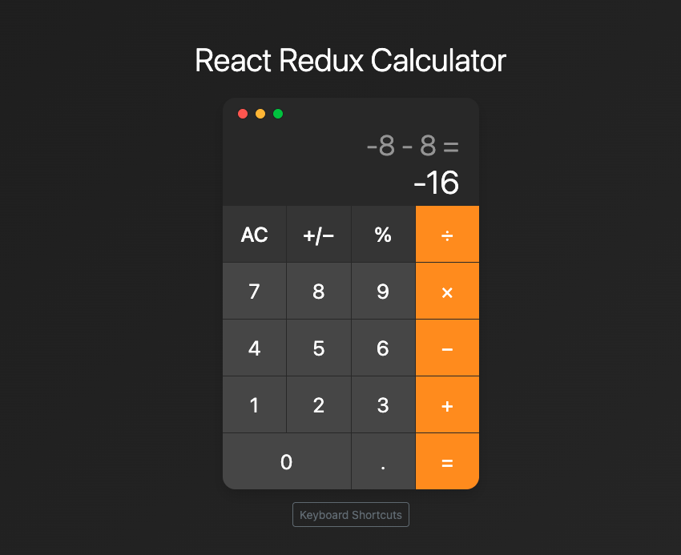

# React Calculator

A modern calculator application built with React, Redux Toolkit, and Bootstrap. Features a clean interface, keyboard support, and comprehensive test coverage.



## Features

- Basic arithmetic operations (+, -, ×, ÷)
- Decimal point support
- Percentage calculations
- Sign toggle (+/-)
- Clear entry (CE) and All Clear (AC)
- Keyboard support
- Responsive design
- Error handling for division by zero and large numbers
- Operation history display

## Technologies Used

- React 18.2.0
- Redux Toolkit 2.8.2
- React Bootstrap 2.10.10
- Bootstrap 5.3.7
- Vite 7.1.2
- Vitest for testing
- React Testing Library

## Prerequisites

- Node.js (v18 or higher)
- npm (v10 or higher)

## Installation

1. Clone the repository:

   ```bash
   git clone https://github.com/Somesh-Dahatonde/react-calculator-altr.git
   cd react-calculator
   ```

2. Install dependencies:
   ```bash
   npm install
   ```

## Running the Application

1. Start the development server:

   ```bash
   npm run dev
   ```

2. Open your browser and navigate to:
   ```
   http://localhost:5173
   ```

## Running Tests

Run all tests:

```bash
npm test
```

Run tests with coverage:

```bash
npm test -- --coverage
```

## Keyboard Shortcuts

| Key       | Function      |
| --------- | ------------- |
| 0-9       | Input numbers |
| .         | Decimal point |
| + or =    | Add           |
| -         | Subtract      |
| \* or x   | Multiply      |
| /         | Divide        |
| Enter     | Calculate     |
| Backspace | Clear Entry   |
| Delete    | All Clear     |
| %         | Percentage    |

## Project Structure

```
react-calculator/
├── src/
│   ├── components/
│   │   ├── Button/
│   │   ├── Calculator/
│   │   ├── Display/
│   │   ├── KeyboardHelp/
│   │   └── Keypad/
│   ├── features/
│   │   └── calculator/
│   ├── hooks/
│   └── utils/
├── __tests__/
└── public/
```

## Testing Coverage

Current test coverage is maintained at:

- Statements: 75.88%
- Functions: 74.49%
- Branches: 58.33%
- Lines: 75.88%

## Contributing

1. Fork the repository
2. Create your feature branch (`git checkout -b feature/AmazingFeature`)
3. Commit your changes (`git commit -m 'Add some AmazingFeature'`)
4. Push to the branch (`git push origin feature/AmazingFeature`)
5. Open a Pull Request

## License

This project is licensed under the MIT License - see the LICENSE file for details.

## Acknowledgments

- Design inspired by macOS calculator
- Built with React and modern web technologies
- Tested with Vitest and React Testing Library
